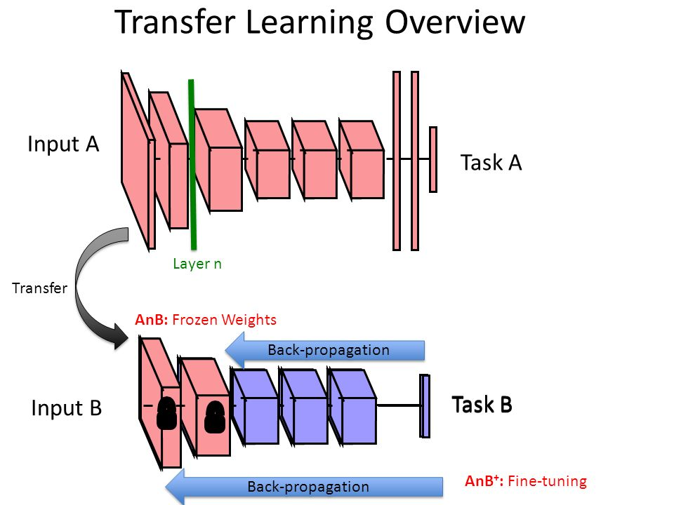

# Object detection with Tensorflow 2 and Pytorch pretrained models

Objective of this repository to demostrate how easy is to build an object detection algorithm with pretrained massive models. 
To show the power of these models, I did not finetune the models and only used the pretraned weights, no additional laysers or training dataset utilised.

## Real life application of the models
Results of the models cleary show that the pretrained models performing reasonably well on new data. For real life application though, you can still use these models as a backbone of your model, then finetune the last layers with specific dataset as shown below

